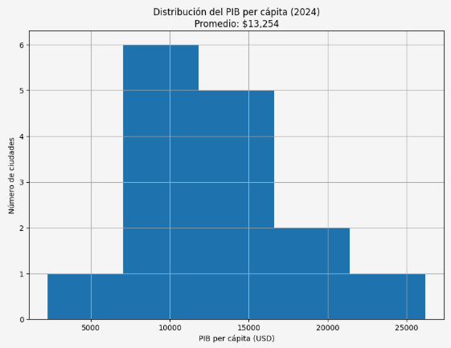

# Movilidad Urbana y Productividad Económica en América Latina (2024)

## 📌 Descripción del Proyecto
La congestión urbana no es solo un problema de transporte: representa un **costo económico estructural** que impacta la productividad, la competitividad y la calidad de vida.  
Este proyecto analiza la relación entre **movilidad urbana** y **productividad económica** en ciudades de América Latina durante el año 2024, integrando datos de tráfico y economía urbana.

El análisis está orientado a apoyar la **toma de decisiones basada en datos**, especialmente para la priorización de inversiones en infraestructura de transporte.

---

## 🎯 Pregunta de Negocio
**¿Qué relación existe entre la congestión urbana y la productividad económica en las principales ciudades de América Latina?**

Preguntas complementarias:
- ¿Qué ciudades presentan **alta congestión y baja productividad**?
- ¿Cuáles muestran el **mejor desempeño combinado** (movilidad eficiente + economía fuerte)?
- ¿Qué variables de movilidad tienen mayor relación con el desempeño económico?

---

## 📊 Fuentes de Datos
- **TomTom Traffic Index**  
  Indicadores de congestión, tiempos de viaje e intensidad del tráfico.
- **OECD City Economy Database**  
  Indicadores económicos urbanos: PIB per cápita, desempleo, contaminación y población.

**Cobertura validada:**
- Año: **2024**
- Ciudades: **15**
- Países: **7** (MEX, BRA, COL, PER, CHL, ARG, URY)

---

## 🧠 Metodología

### Limpieza y Estandarización
- Renombrado de columnas a formato `snake_case`.
- Normalización de separadores decimales y de miles.
- Conversión de fechas a formato datetime (UTC).
- Validación de tipos de datos y valores nulos.
- Cálculo de población total a partir de población en millones.

### Ingeniería de Variables
- Extracción del año desde los timestamps de tráfico.
- Agregación de indicadores de movilidad por **ciudad–país–año** utilizando promedios.
- Selección de variables clave comparables entre movilidad y economía.

### Integración de Datos
- Filtrado de ambos datasets al año **2024**.
- Unión mediante **INNER JOIN** por `city` y `year`.
- Reordenamiento de columnas para facilitar lectura e interpretación.

### Técnicas de Análisis
- Estadística descriptiva
- Análisis de distribución (histogramas y boxplots)
- Comparaciones entre ciudades
- Análisis exploratorio de correlación
- Identificación de outliers y ciudades benchmark

---

## 📈 Variables Clave

### Movilidad Urbana
- **Jams Delay**: costo agregado de congestión en minutos.
- **Mins Delay**: retraso efectivo promedio.
- **Travel Time Live per 10 km**: experiencia real de viaje.
- **Traffic Index Live**: intensidad relativa de congestión.

### Productividad Económica
- **PIB per cápita (City GDP per capita)**: indicador central de productividad y competitividad urbana.

---

## 📊 Principales Hallazgos

### 1. Panorama Regional: Distribución Económica

La distribución del PIB per cápita en América Latina muestra un promedio regional de **$13,254 USD**, con la mayoría de países concentrados en el rango medio-bajo, evidenciando disparidades económicas significativas en la región.

### 2. Patrones de Congestión Urbana

El análisis de congestión revela un promedio de **629.52 minutos de retraso**, con valores atípicos que indican diferencias extremas en la eficiencia del transporte urbano entre ciudades.

### 3. Relación Congestión vs Productividad

#### Correlación Identificada
- Se observa una **relación negativa moderada a fuerte** entre congestión y productividad económica
- La correlación entre **mins_delay** y **PIB per cápita** es aproximadamente **r ≈ –0,6**
- Ciudades con mayores retrasos efectivos tienden a presentar menor productividad por habitante

#### Desempeño por Ciudad

**🔴 Peor desempeño combinado:**
- **Bogotá** y **Lima**  
  - Alta congestión (1,70 y 1,51 min por cada 10 km)
  - Bajo PIB per cápita (USD 11.442 y USD 13.472)

**🟢 Mejor desempeño combinado:**
- **Buenos Aires** y **Montevideo**  
  - Congestión baja o moderada (≤0,42 min)
  - PIB per cápita alto (USD 18.117 y USD 26.176)

#### Casos Especiales (Outliers)
- **Ciudad de México**: Alta congestión pero PIB per cápita elevado (efecto escala metropolitana)
- **Santiago**: Congestión moderada con PIB per cápita menor al esperado (requiere validación de datos)

### 4. Insight Estratégico
**Potencial de mejora:** Reducir la congestión de Bogotá a niveles similares a Buenos Aires podría asociarse a una **mejora potencial del 10–15% en productividad efectiva**.

---

## 🧭 Recomendaciones Estratégicas

### Nivel Estratégico (Alta Dirección)
- Tratar el **retraso efectivo (mins_delay)** como una **variable económica estratégica**, no solo de movilidad.
- Priorizar inversiones en ciudades con **alto ratio congestión / PIB per cápita (>0,15)**.
- Asignar al menos **60% del presupuesto de transporte urbano** a ciudades con mayor retorno económico marginal.

### Nivel Operativo (Equipos País)
- Focalizar inversión en transporte masivo (BRT, Metro, corredores segregados).
- Ciudades prioritarias: **Bogotá y Lima**.
- Horizonte de estructuración: **Q1–Q2 2025**.

### Nivel Analítico (Equipos Técnicos)
- Avanzar hacia análisis causal:
  - Regresiones multivariadas
  - Modelos panel ciudad–año
- Validar outliers mediante revisión de fuentes y ajustes metodológicos.

---

## ⚠️ Limitaciones
- Análisis basado en correlaciones (no causal).
- Información concentrada en un solo año (2024).
- Variables económicas agregadas a nivel ciudad.

---

## 🔮 Próximos Pasos
- Extender el análisis a un panel multianual.
- Incorporar costos de inversión para evaluar retornos ajustados.
- Integrar variables sociales y ambientales.

---

## 🛠️ Tecnologías Utilizadas
- Python
- pandas
- matplotlib
- seaborn
- Jupyter Notebook

---

## 📂 Estructura del Repositorio

 data/
 
   └── movilidad_latam_2024.csv
   
notebooks/

   └── analisis_movilidad_productividad.ipynb
   
images/

   └── (todas tus visualizaciones)

## 📌 Conclusión
La congestión urbana representa un **costo económico cuantificable**.  
Con una correlación de **r ≈ –0,6**, cada minuto adicional de retraso por cada 10 km recorridos se asocia con menor productividad urbana.  
**Bogotá y Lima** emergen como oportunidades prioritarias de inversión, mientras que **Montevideo y Buenos Aires** actúan como benchmarks regionales de eficiencia urbana.
